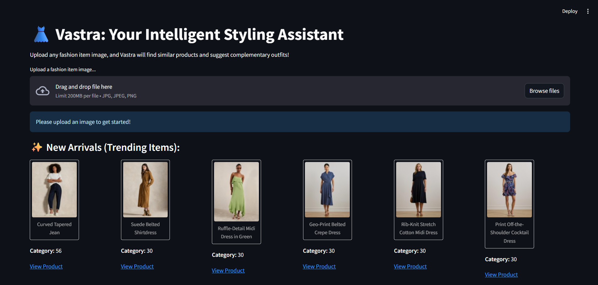
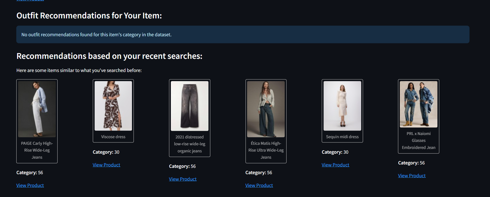

# Vastra: Intelligent Styling Assistant 👗

## Table of Contents

1.  [Project Overview](#project-overview)
2.  [Features](#features)
3.  [Project Structure](#project-structure)
4.  [Setup Instructions](#setup-instructions)
    * [Prerequisites](#prerequisites)
    * [1. Clone the Repository](#1-clone-the-repository)
    * [2. Create a Virtual Environment](#2-create-a-virtual-environment)
    * [3. Install Dependencies](#3-install-dependencies)
    * [4. Download the Dataset](#4-download-the-dataset)
    * [5. Run Data Preparation Script](#5-run-data-preparation-script)
    * [6. Run Feature Extraction Script](#6-run-feature-extraction-script)
    * [7. Run Faiss Index Creation Script](#7-run-faiss-index-creation-script)
    * [8. Update Recommendation Logic Category Mappings](#8-update-recommendation-logic-category-mappings)
    * [9. Set Environment Variable (Crucial)](#9-set-environment-variable-crucial)
5.  [How to Run the Application](#how-to-run-the-application)
6.  [Usage](#usage)
7.  [Future Enhancements](#future-enhancements)
8.  [Acknowledgements](#acknowledgements)

---

## Project Overview

**Vastra** is an end-to-end machine learning system designed to revolutionize the fashion e-commerce experience through visual search and intelligent styling. Addressing the challenge that traditional text-based search often fails to capture the nuanced visual details of fashion items, Vastra allows users to upload any fashion image (from social media, street photography, or their own wardrobe) and receive accurate, visually-driven recommendations.

The system processes and understands fashion imagery to provide:
* Exact and visually similar products from an available inventory.
* Intelligent outfit suggestions that complement the searched item, considering style compatibility.
* Personalized recommendations based on user interaction patterns.
* Insights into current fashion trends through "New Arrivals."


---



## Features

* **Visual Similarity Search:** Utilizes deep learning models (ResNet) and efficient similarity search algorithms (Faiss) to find products that look visually similar to an uploaded image from a large inventory.
* **Outfit Recommendations:** Provides suggestions for complete outfits that complement a chosen fashion item, incorporating both category and basic style compatibility (`style_attributes`).
* **Personalized Recommendations:** Learns from the user's recent search history within a session to offer tailored product suggestions that align with their past interests.
* **Trend Awareness ("New Arrivals"):** Displays recently launched products from the dataset, acting as a "trending items" section without manual intervention.
* **Product Detail Links:** Integrates direct links (`pdp_url`) for both similar products and recommended outfit items, enabling users to view or purchase the products.
* **User-Friendly Interface (UI):** Built with Streamlit, providing an intuitive and interactive web application for easy image uploads and result visualization.
* **Scalability Foundation:** Designed with a modular architecture that can be extended for scalable deployment in a production environment.

## Project Structure

```
Vastra/
├── app/
│   └── app.py                     # Main Streamlit web application that integrates all functionalities
├── data/
│   ├── dresses_bd_processed_data.csv# Original dataset for dresses
│   ├── jeans_bd_processed_data.csv    # Original dataset for jeans
│   └── vastra_processed_data_with_local_paths.csv # Combined and processed dataset with local image paths
├── downloaded_fashion_images/     # Directory where all product images from URLs are downloaded and stored
├── models/
│   ├── vastra_image_embeddings.npy  # NumPy array of extracted image features (embeddings)
│   ├── vastra_product_ids_for_embeddings.npy # NumPy array of product IDs corresponding to embeddings
│   └── vastra_faiss_index.bin       # Faiss similarity search index file
├── Scripts/
│   ├── step_1_data_prep.py          # Script for data download, initial processing, and image saving
│   ├── step_2_feature_extraction.py # Script for extracting deep features (embeddings) from images
│   ├── step_3_visual_search_index.py# Script for building the Faiss similarity search index
│   └── step_4_demonstrate_outfit_rec.py # (Optional) Command-line script to test outfit recommendation logic
├── utils/
│   ├── init.py                  # Makes 'utils' a Python package
│   └── recommendation_logic.py      # Contains the core logic for outfit and style-based recommendations
├── .streamlit/                    # Streamlit configuration directory
│   └── config.toml                # Streamlit configuration file (e.g., to disable magic reloader)
├── .gitignore                     # Specifies intentionally untracked files to ignore by Git
├── requirements.txt               # List of all Python dependencies required for the project
└── README.md                      # This project documentation file
```
## Setup Instructions

Follow these steps to set up and run the Vastra application on your local machine.

### Prerequisites

* **Python 3.8+** (Python 3.12 was used during development, ensure compatibility with your PyTorch/CUDA setup)
* `pip` (Python package installer)

### 1. Clone the Repository

If you are using Git, clone the project repository:

```bash
git clone <your-repository-url>
cd Vastra
```
if not using Git, simply download the Vidura folder and navigate into it.

### 2. Create a Virtual Environment (Recommended)
Creating a virtual environment ensures that project dependencies do not conflict with other Python projects on your system.

```
python -m venv venv
```
Activate the virtual environment:
- On Windows:
```
.\venv\Scripts\activate
```
- On macOS/Linux:
```
source venv/bin/activate
```
### 3. Install Dependencies
Install all required Python libraries listed in requirements.txt:
```
pip install -r requirements.txt
```
Note: The requirements.txt includes a specific PyTorch version (torch==2.2.0) and corresponding torchvision/torchaudio for CUDA 12.1 or CPU. If your CUDA version is different, you might need to adjust the --index-url or PyTorch versions as per PyTorch official website.

### 4. Download the Dataset
Download the primary dataset files (dresses_bd_processed_data.csv and jeans_bd_processed_data.csv) from the provided Drive Link. Place these .csv files inside the data/ directory of your project.

### 5. Run Data Preparation Script
This script downloads images from the URLs specified in the CSVs and combines your datasets into a single processed file (vastra_processed_data_with_local_paths.csv).

Navigate to your project's root directory (Vastra/) in your terminal and run:

```
python Scripts/step_1_data_prep.py
```

### 6. Run Feature Extraction Script
This script uses a pre-trained deep learning model (ResNet50) to extract numerical features (embeddings) from all the downloaded images. These embeddings are crucial for visual similarity search.

From the project root directory, run:
```
python Scripts/step_2_feature_extraction.py
```

### 7. Run Faiss Index Creation Script
This script builds an efficient similarity search index using Faiss based on the extracted image embeddings.

From the project root directory, run:
```
python Scripts/step_3_visual_search_index.py
```

### 8. Update Recommendation Logic Category Mappings
The outfit recommendation engine relies on mapping numerical category_id values from your dataset to broader, human-readable categories.

Open utils/recommendation_logic.py and ensure the self.category_mapping dictionary is correctly configured based on the actual category_id values (e.g., 30 for Dresses, 56 for Bottomwear/Jeans) present in your vastra_processed_data_with_local_paths.csv. Also, ensure the _get_product_style_keywords function correctly extracts relevant style attributes from the style_attributes JSON in your data.

### 9. Set Environment Variable (Crucial)
To prevent runtime crashes related to OpenMP conflicts (e.g., OMP: Error #15), it is crucial to set the KMP_DUPLICATE_LIB_OK environment variable.

For the current terminal session:
```
Set Environment Variable (Crucial)
To prevent runtime crashes related to OpenMP conflicts (e.g., OMP: Error #15), it is crucial to set the KMP_DUPLICATE_LIB_OK environment variable.

For the current terminal session:
```

You must run this command in every new terminal session before launching the Streamlit app.

- To set it permanently on Windows (Recommended):

1. Search for "Environment Variables" in the Windows search bar and select "Edit the system environment variables".
2. In the "System Properties" window, click "Environment Variables...".
3. Under "System variables", click "New...".
4. Set Variable name: KMP_DUPLICATE_LIB_OK
5. Set Variable value: TRUE
6. Click "OK" on all open dialogs.
7. Restart any open terminals/IDEs for the change to take effect.

## How to Run the Application
Once all setup steps are complete and the environment variable is set (if done per-session), launch the Streamlit application from your project's root directory (Vidura/):

```
streamlit run app/app.py
```
The application will automatically open in your default web browser (usually at http://localhost:8501).

## Usage
1. Upload an Image: On the app's home page, use the file uploader to select and upload any fashion item image (JPG, JPEG, PNG).
2. View Results:
    - Your Uploaded Item: Your uploaded image will be displayed.
    Visually Similar Products: The system will search for and display the top 5 visually similar products from the database, along with their categories and direct links (View Product).
    - Outfit Recommendations: Based on the category and style of the most similar product found, the app will suggest complementary outfit items. (Note: These recommendations will only appear if your dataset contains items in complementary categories like "Topwear", "Footwear", "Accessories".)
    - Recommendations based on your recent searches: As you upload more images, this section will suggest products based on the categories and brands of your past searches within the current session.
    - New Arrivals (Trending Items): A separate section will showcase the most recently launched products from the entire dataset.
3. Explore Products: Click on the "View Product" links to open the product detail page in a new tab.


## Future Enhancements
The current prototype provides a strong foundation. Here are areas for future development and improvement:

- Advanced Style Compatibility:
    - Implement more sophisticated algorithms to understand and match fashion styles beyond simple keyword matching (e.g., using learned style embeddings, training compatibility prediction models via Siamese networks).
    - Leverage deeper insights from description and feature_list columns using advanced NLP techniques.
- Quantitative Evaluation:
    - Develop a dedicated evaluation framework to measure the "success rate" (e.g., Precision@K, Recall@K, mAP) of the visual search and the "best fits" for outfit recommendations. This would require a ground-truth labeled test set.
- Persistent Personalized Recommendations:
    - Implement user authentication and a database (e.g., Firestore, PostgreSQL) to store long-term user search history, liked items, and preferences. This allows for truly personalized recommendations across sessions and devices.
- Enhanced Trend Awareness:
    - Integrate external fashion trend data (e.g., from fashion blogs, social media analytics, sales data if available) to provide more dynamic and accurate trend-based recommendations.
- Scalable Deployment:
    - Transition the application from a local prototype to a scalable cloud-based microservices architecture (e.g., using Docker, Kubernetes, cloud platforms like AWS, GCP, Azure). This would involve separating components (API Gateway, Feature Extraction Service, Search Service, Recommendation Service) for handling large numbers of concurrent users and API calls.
- Multi-Modal Search:
    - Allow users to combine visual input with text queries (e.g., "red floral dress" + image of a dress) for more precise search results.
- Interactive Outfit Builder:
    - Enable users to build outfits directly within the app by dragging and dropping items and getting real-time compatibility feedback.


## Acknowledgements
- This project uses pre-trained models from PyTorch and Torchvision.
- Similarity search is powered by Faiss.
- The interactive web interface is built using Streamlit.
- Data manipulation is handled by Pandas and NumPy.
