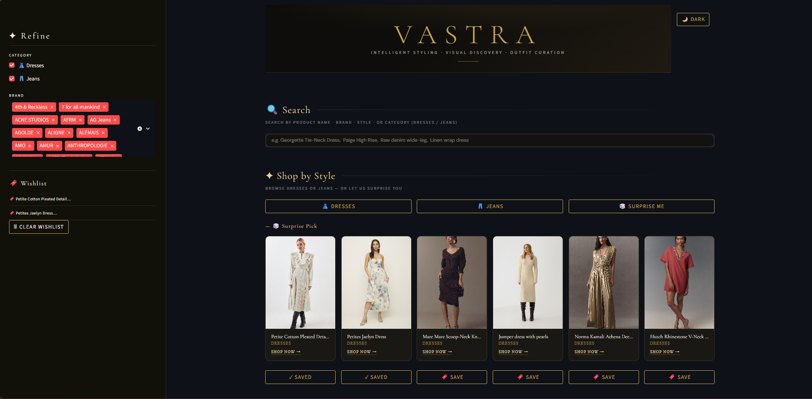
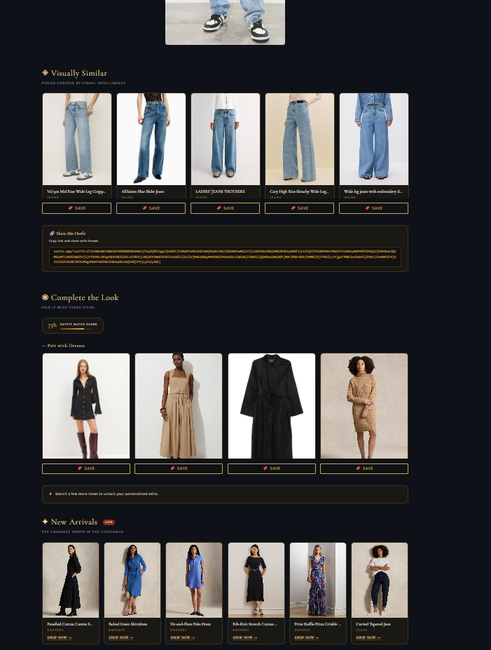

# 👗 Vastra — Visual Search, Styling & Personalised Fashion Discovery

## Table of Contents

- [👗 Vastra — Visual Search, Styling \& Personalised Fashion Discovery](#-vastra--visual-search-styling--personalised-fashion-discovery)
  - [Table of Contents](#table-of-contents)
  - [Project Overview](#project-overview)
  - [Features](#features)
  - [Project Structure](#project-structure)
  - [Setup Instructions](#setup-instructions)
    - [Prerequisites](#prerequisites)
    - [1. Clone the Repository](#1-clone-the-repository)
    - [2. Create a Virtual Environment (Recommended)](#2-create-a-virtual-environment-recommended)
    - [3. Install Dependencies](#3-install-dependencies)
    - [4. Download the Dataset](#4-download-the-dataset)
    - [5. Run Data Preparation Script](#5-run-data-preparation-script)
    - [6. Run Feature Extraction Script](#6-run-feature-extraction-script)
    - [7. Run Faiss Index Creation Script](#7-run-faiss-index-creation-script)
  - [How to Run the Application](#how-to-run-the-application)
  - [How it Works](#how-it-works)
  - [Acknowledgements](#acknowledgements)

---

## Project Overview

**Vastra** is a visual fashion search and styling system that lets users upload any clothing image and discover similar products, outfit combinations, and personalized recommendations.

The system processes and understands fashion imagery to provide:
* Visual Search — Find similar products using image embeddings (ResNet + FAISS)
* Outfit Recommendations — Get complementary items (Dress ↔ Jeans logic)
* Personalised Picks — Based on recent user interactions
* New Arrivals — Automatically surfaces latest products
* Wishlist — Save products across all sections
* Fast Retrieval — FAISS-based similarity search


---



## Features
* **Visual Similarity Search:** Leverages deep learning (ResNet50) and FAISS indexing to retrieve visually similar fashion products from a large-scale inventory with high efficiency.  
* **Outfit Recommendations:** Generates complementary outfit suggestions using category mapping (e.g., dresses ↔ jeans) along with basic style compatibility signals.  
* **Personalized Recommendations:** Adapts to user behavior within a session to surface products aligned with recent interactions and preferences.  
* **Trend Awareness ("New Arrivals"):** Dynamically highlights recently added products to reflect current catalog trends without manual curation.  
* **Product Detail Links:** Provides direct navigation (`pdp_url`) to product pages for seamless exploration and purchase flow.  
* **Interactive UI (Streamlit):** Clean and responsive interface enabling quick image upload, real-time results, and smooth browsing experience.  
  

## Project Structure

```
Vastra/
├── app/
│   └── app.py                  
├── data/
├── models/
├── Scripts/
├── utils/
├── .gitignore                     
├── requirements.txt              
└── README.md                      
```
## Setup Instructions

Follow these steps to set up and run the Vastra application on your local machine.

### Prerequisites

* **Python 3.8+** (Python 3.12 was used during development, ensure compatibility with your PyTorch/CUDA setup)
* `pip` (Python package installer)

### 1. Clone the Repository

If you are using Git, clone the project repository:

```bash
git clone <your-repository-url>
cd Vastra
```
if not using Git, simply download the Vidura folder and navigate into it.

### 2. Create a Virtual Environment (Recommended)
Creating a virtual environment ensures that project dependencies do not conflict with other Python projects on your system.

```
python -m venv venv
```
Activate the virtual environment:
- On Windows:
```
.\venv\Scripts\activate
```
- On macOS/Linux:
```
source venv/bin/activate
```
### 3. Install Dependencies
Install all required Python libraries listed in requirements.txt:
```
pip install -r requirements.txt
```
Note: The requirements.txt includes a specific PyTorch version (torch==2.2.0) and corresponding torchvision/torchaudio for CUDA 12.1 or CPU. If your CUDA version is different, you might need to adjust the --index-url or PyTorch versions as per PyTorch official website.

### 4. Download the Dataset
Download the primary dataset files (dresses_bd_processed_data.csv and jeans_bd_processed_data.csv) from the provided Drive Link. Place these .csv files inside the data/ directory of your project.

### 5. Run Data Preparation Script
This script downloads images from the URLs specified in the CSVs and combines your datasets into a single processed file (vastra_processed_data_with_local_paths.csv).

Navigate to your project's root directory (Vastra/) in your terminal and run:

```
python Scripts/step_1_data_prep.py
```

### 6. Run Feature Extraction Script
This script uses a pre-trained deep learning model (ResNet50) to extract numerical features (embeddings) from all the downloaded images. These embeddings are crucial for visual similarity search.

From the project root directory, run:
```
python Scripts/step_2_feature_extraction.py
```

### 7. Run Faiss Index Creation Script
This script builds an efficient similarity search index using Faiss based on the extracted image embeddings.

From the project root directory, run:
```
python Scripts/step_3_visual_search_index.py
```

## How to Run the Application
Once all setup steps are complete and the environment variable is set (if done per-session), launch the Streamlit application from your project's root directory (Vidura/):

```
streamlit run app/app.py
```
The application will automatically open in your default web browser (usually at http://localhost:8501).

## How it Works
1. Upload an image
2. Extract features (ResNet50)
3. Search similar items (FAISS)
4. Recommend outfit + personalised results


## Acknowledgements
- This project uses pre-trained models from PyTorch and Torchvision.
- Similarity search is powered by Faiss.
- The interactive web interface is built using Streamlit.
- Data manipulation is handled by Pandas and NumPy.
